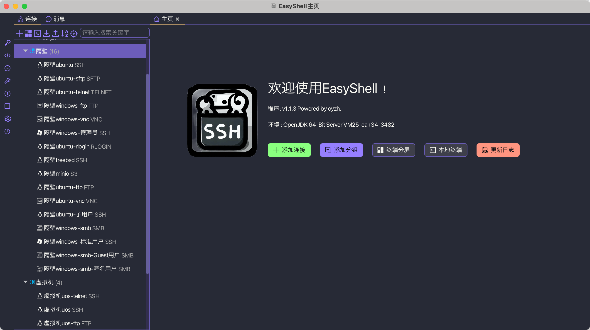
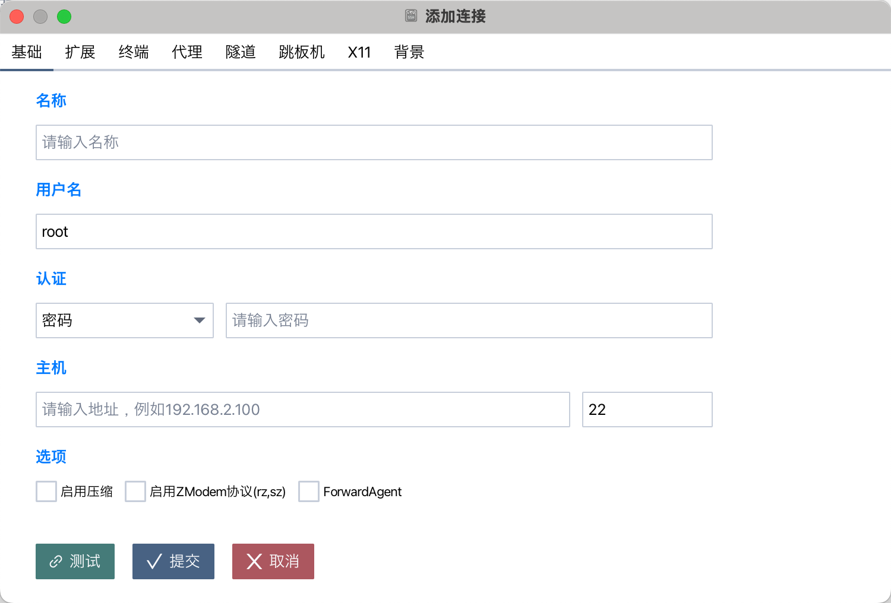
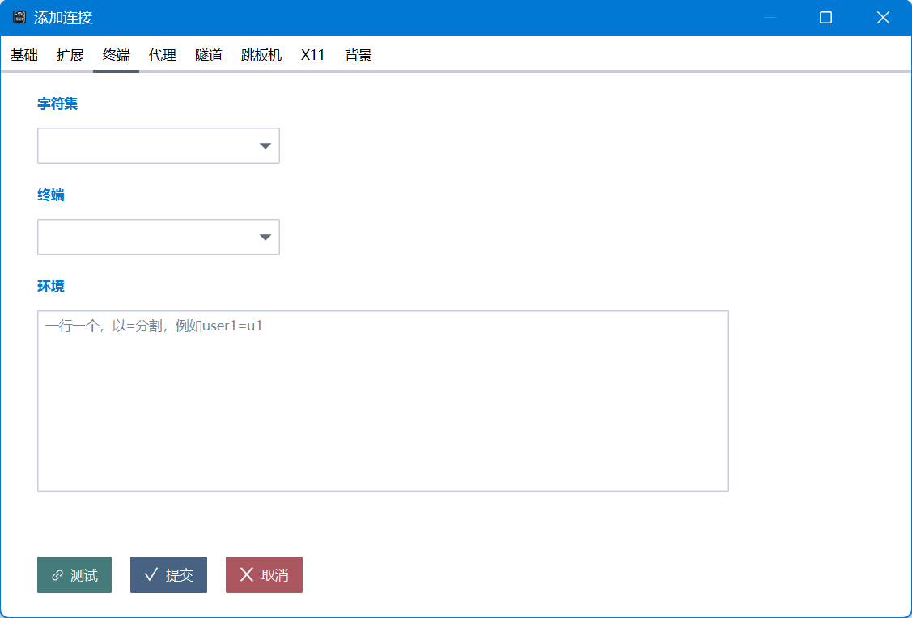
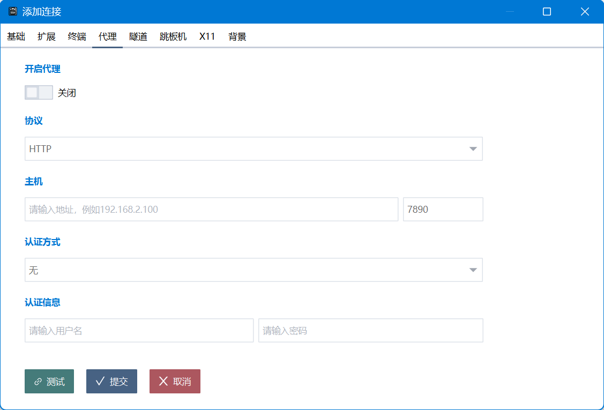
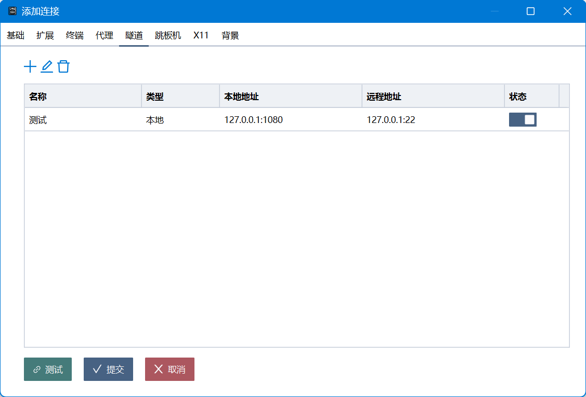
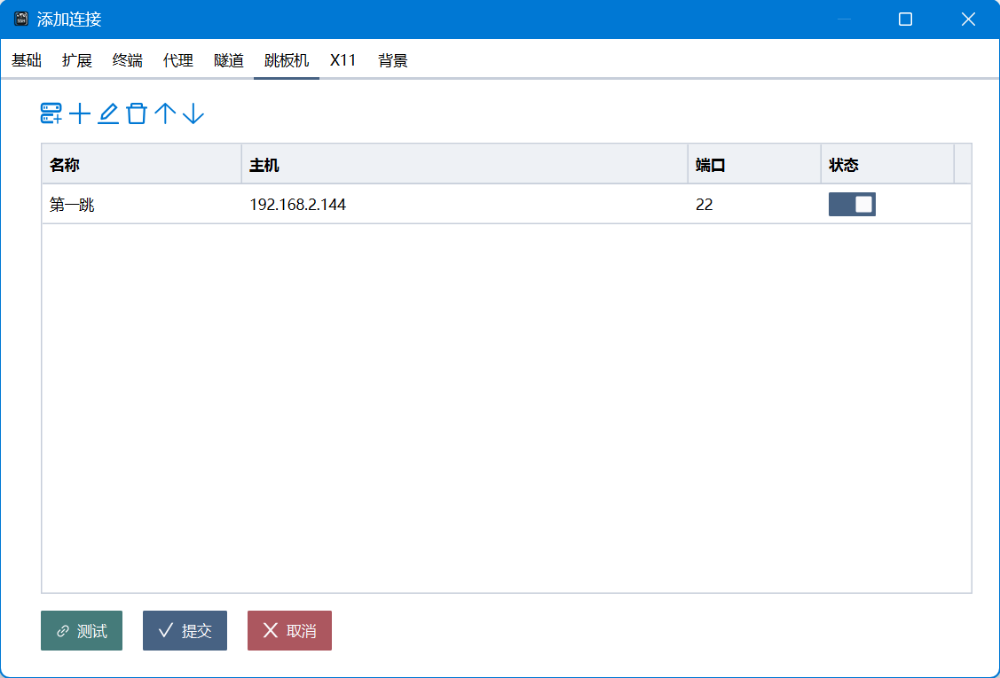
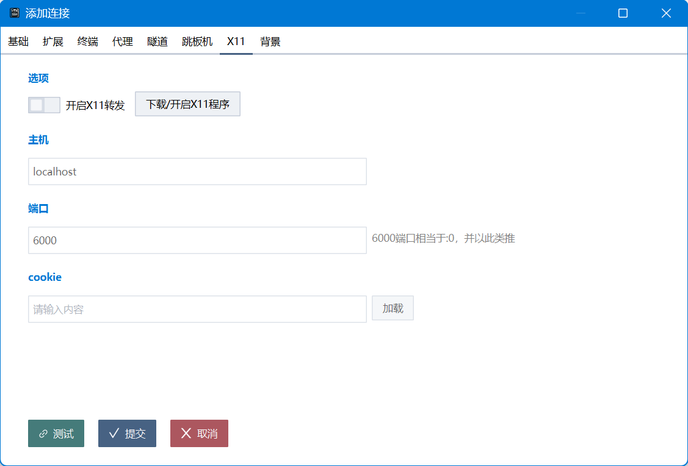
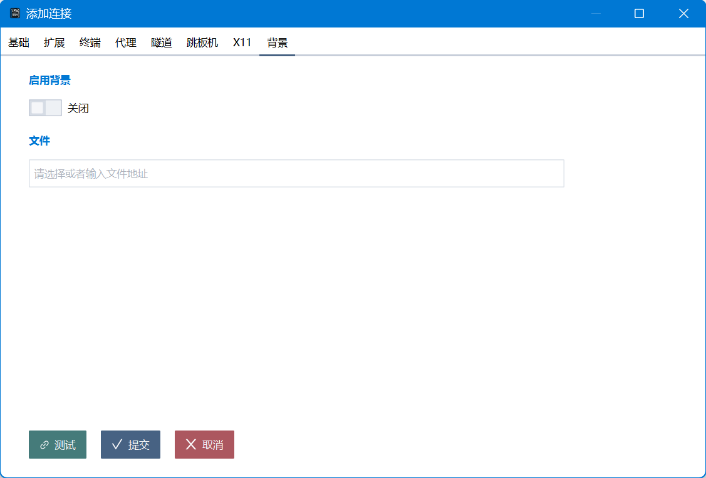

# EasyShell

## 项目说明
EasyShell 是一个功能强大、现代化、跨平台的多协议客户端，支持多种连接方式，包括 SSH、FTP、SFTP、Redis、ZooKeeper、串口、VNC、Telnet、RLogin、S3、SMB、本地终端等。它提供了丰富的功能，如连接管理、文件传输、密钥管理、片段执行、Docker 管理、Redis 和 ZooKeeper 数据操作等。

## 功能特性
- **多协议支持**：支持 SSH、FTP、SFTP、Redis、ZooKeeper、串口、VNC、Telnet、RLogin、S3、SMB、本地终端等多种连接方式。
- **连接管理**：支持连接的添加、编辑、删除、导入、导出等操作。
- **文件传输**：支持文件上传、下载、删除、重命名、权限修改等操作。
- **密钥管理**：支持密钥的生成、导入、导出、复制等操作。
- **片段执行**：支持代码片段的保存和执行。
- **Docker 管理**：支持 Docker 容器和镜像的管理。
- **Redis 数据操作**：支持 Redis 数据的增删改查、导出、导入、迁移等操作。
- **ZooKeeper 数据操作**：支持 ZooKeeper 节点的增删改查、ACL 管理、权限设置等操作。
- **跨平台**：支持 Windows、macOS、Linux 等多个操作系统。

## 下载地址
[EasyShell Releases](https://gitee.com/oyzh1994/easyshell/releases)

## 开发相关
请查看 [dev.README.md](dev.README.md) 了解项目开发相关的内容，包括构建、打包、依赖管理等。

## 程序相关截图
### 主页

### 设置

### 连接

### SSH

### 分屏

### Zookeeper

### Redis

### SFTP

### S3

### SMB

### VNC

### Telnet

### FTP

### 本地终端

### 串口

### RLogin

### 工具

### 密钥

### 片段

### 关于
