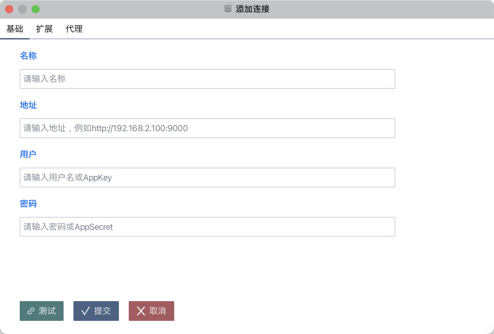
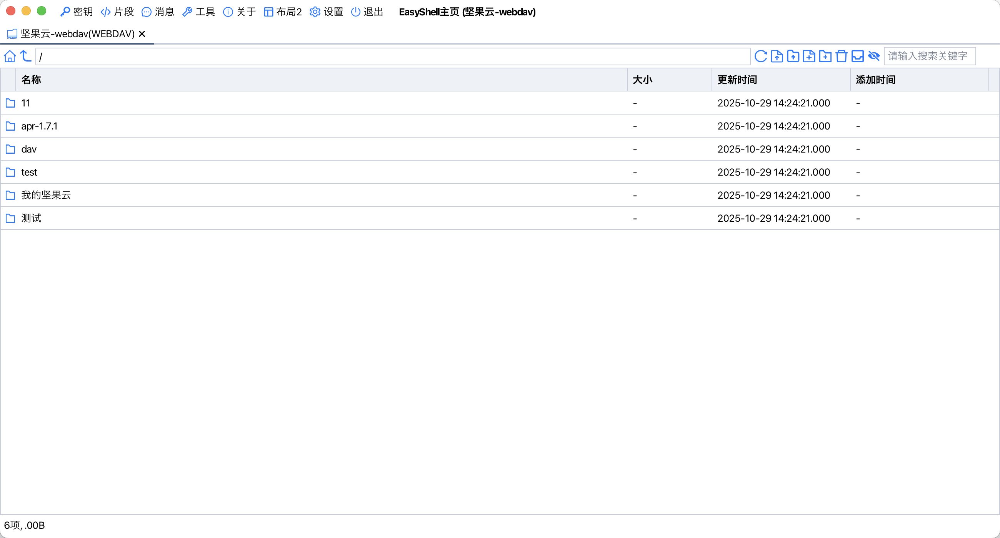

# EasyShell

## 项目说明
EasyShell 是一个功能强大、现代化、跨平台的多协议客户端。

## 功能特性
- **多协议支持**：支持 SSH、FTP、SFTP、Redis、ZooKeeper、串口、VNC、Telnet、RLogin、S3、RDP、SMB、Webdav、Mysql、本地终端等多种连接方式。
- **连接管理**：支持连接的添加、编辑、删除、导入、导出等操作。
- **文件传输**：支持文件上传、下载、删除、重命名、权限修改等操作。
- **密钥管理**：支持密钥的生成、导入、导出、复制等操作。
- **片段执行**：支持代码片段的保存和执行。
- **SSH 仿真终端**：支持 SSH 协议的连接、服务监控、sftp、docker管理、进程管理、服务信息查看，配置文件查看等操作。
- **RLogin 仿真终端**：支持 RLogin 协议的连接。
- **Telnet 仿真终端**：支持 Telnet 协议的连接。
- **SerialPort仿真终端**：支持 SerialPort 协议的连接。
- **S3 客户端**：支持 S3 协议的连接、文件管理，上传、下载、更名、桶新增、修改、删除等操作。
- **SMB 客户端**：支持 SMB 协议的连接、文件管理，上传、下载、更名等操作。
- **Webdav 客户端**：支持 Webdav 协议的连接、文件管理，上传、下载、更名等操作。
- **FTP 客户端**：支持 FTP 协议的连接、文件管理，上传、下载、更名等操作。
- **SFTP 客户端**：支持 SFTP 协议的连接、文件管理，上传、下载、更名等操作。
- **VNC 客户端**：支持 VNC 协议的连接。
- **RDP 客户端**：支持 RDP 协议的连接。
- **Redis 客户端**：支持 Redis 协议的增删改查、导出、导入、传输、终端等操作。
- **ZooKeeper 客户端**：支持 ZooKeeper 协议的增删改查、ACL管理、权限设置、导入、导出、传输、终端等操作。
- **Mysql 客户端**：支持 Mysql 协议的表、视图、函数、过程、事件、视图管理、查询、导入、导出、传输等操作。
- **本地终端**：支持windows、linux、macos各类本地终端，比如sh、bash、zsh、cmd、powershell、git-sh、git-bash等。
- **跨平台**：支持 Windows、macOS、Linux 等多个操作系统。

## 下载地址
[EasyShell Releases](https://github.com/oyzh1994/easyshell/releases)

## 开发相关
请查看 [jfx.README.md](jfx.README.md) 了解jfx相关知识等。  
请查看 [dev.README.md](dev.README.md) 了解项目开发相关的内容，包括构建、打包、依赖管理等。  

## 程序相关截图
### 主页

### 设置

### 连接

### SSH

### 分屏

### Zookeeper

### Redis

### SFTP

### S3

### RDP

### SMB

### VNC

### Telnet

### FTP

### 本地终端

### 串口

### RLogin

### Webdav

### Mysql

### 工具

### 密钥

### 片段

### 消息

### 关于

### 更新日志

