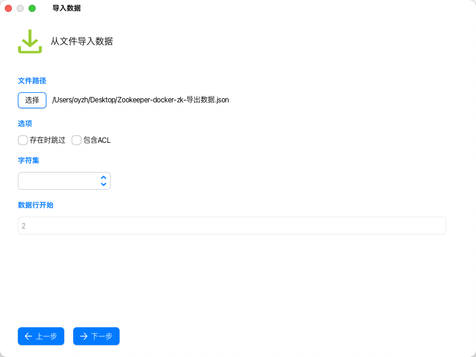
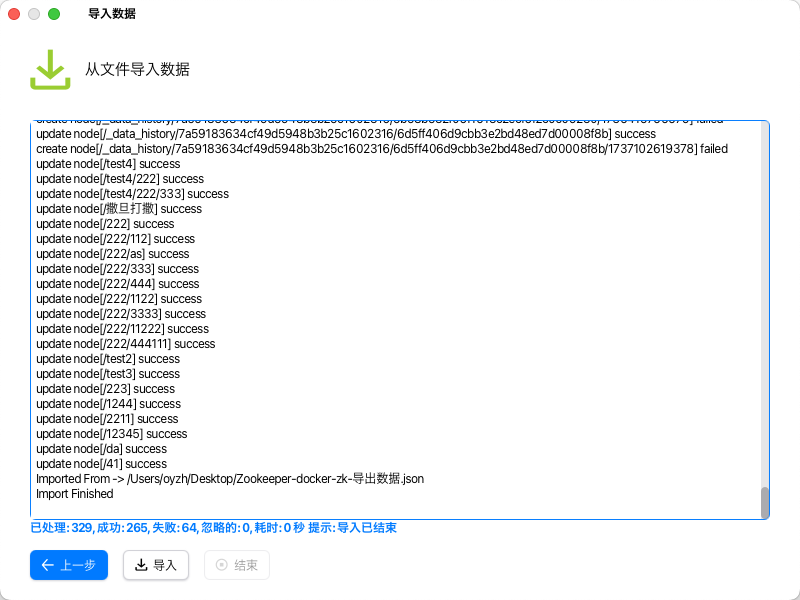
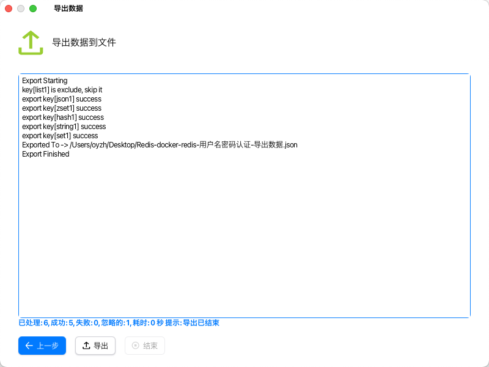
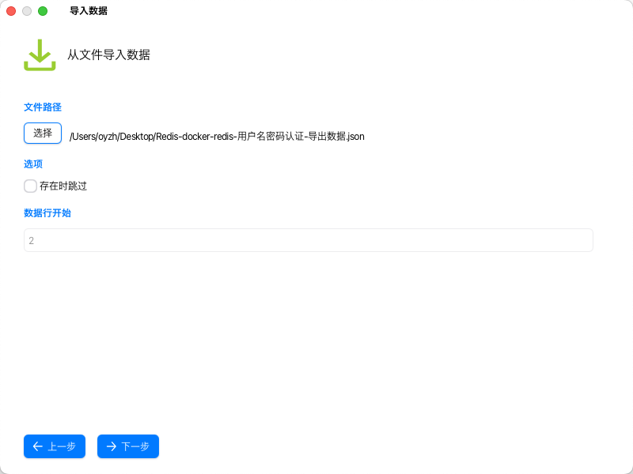
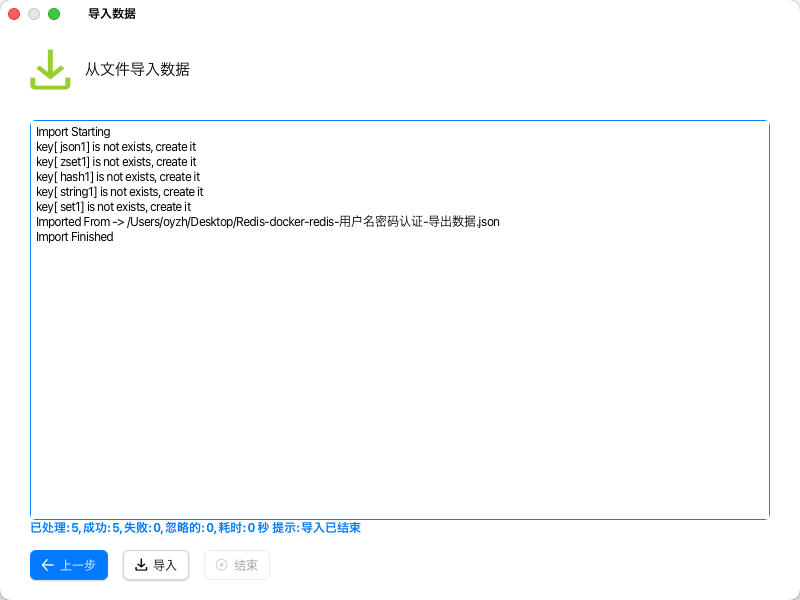

# EasyShell

A powerful, modern, cross-platform, multi-protocol client.

## Features

- **Multi-Protocol Support**: SSH, FTP, SFTP, Redis, ZooKeeper, Serial Port, VNC, Telnet, RLogin, S3, RDP, SMB, WebDAV, MySQL, MongoDB, Mosh, and local terminal connections.
- **Connection Management**: Add, edit, delete, import, and export connections.
- **SSH Key Management**: Generate, import, export, edit, and copy SSH keys to remote hosts.
- **Code Snippets**: Save and execute code snippets across sessions.
- **SSH Terminal**: Full SSH protocol support with server monitoring, SFTP, Docker management, process management, service information, and configuration file editing.
- **RLogin Terminal**: RLogin protocol terminal emulation.
- **Telnet Terminal**: Telnet protocol terminal emulation.
- **Serial Port Terminal**: Serial port terminal emulation.
- **S3 Client**: S3 protocol support with bucket management, file upload/download, rename, preview, edit, and shareable link generation.
- **SMB Client**: SMB protocol support with file management, upload, download, rename, preview, and edit.
- **WebDAV Client**: WebDAV protocol support with file management, upload, download, rename, preview, and edit.
- **FTP Client**: FTP protocol support with file management, upload, download, rename, preview, and edit.
- **SFTP Client**: SFTP protocol support with file management, upload, download, rename, preview, and edit.
- **VNC Client**: VNC protocol connection and management.
- **RDP Client**: RDP protocol connection and jump host support.
- **Redis Client**: Full CRUD operations, export, import, data transfer, and terminal for Redis.
- **ZooKeeper Client**: Full CRUD operations, ACL management, permissions, import, export, data transfer, and terminal for ZooKeeper.
- **MySQL Client**: Table, view, function, procedure, event management, query, import, export, and data transfer for MySQL.
- **MongoDB Client**: Collection, bucket, function, and user management, query, import, export, and data transfer for MongoDB.
- **Mosh Terminal**: Mosh (Mobile Shell) protocol support for high-latency connections.
- **Local Terminal**: Support for local terminals across Windows, Linux, and macOS including sh, bash, zsh, cmd, PowerShell, Git-SH, and Git-Bash.
- **Cross-Platform**: Runs on Windows, macOS, and Linux.

## Download

[EasyShell Releases](https://github.com/oyzh1994/easyshell/releases)

## Development

Please refer to [jfx.README_EN.md](jfx.README_EN.md) for JavaFX-related information.  
Please refer to [dev.README_EN.md](dev.README_EN.md) for project development details including build, packaging, and dependency management.

## Screenshots

### Home

### Settings

### Connections

### SSH

### Split View

### ZooKeeper

### Redis

### SFTP

### S3

### RDP

### SMB

### VNC

### Telnet

### FTP

### Local Terminal

### Serial Port

### RLogin

### WebDAV

### MySQL

### MongoDB

### Mosh

### Tools

### SSH Keys

### Snippets

### Messages

### About

### Changelog

